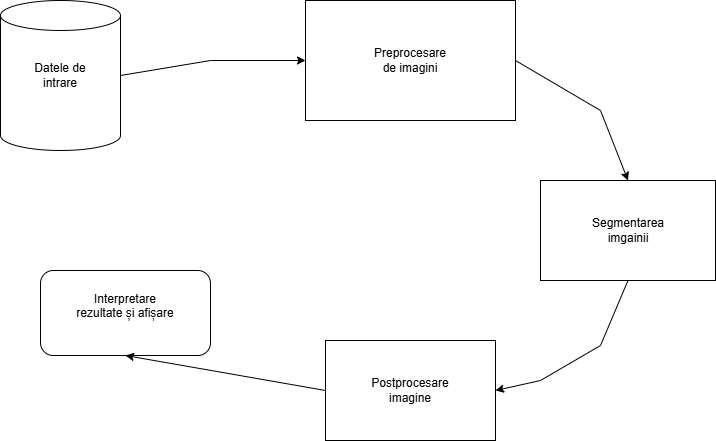

1. Accesarea unei baze de date - preluarea de imagini
2. Preprocesarea imaginii-  eliminare zgomot, îmbunătățire
3. Segmentarea imaginii - alegerea și aplicarea unei metode de a segmenta imaginea( algoritm de prăguire sau rețele neuronale)
4. Postprocesarea imaginii -  aplicare filtre, corecții
5. Interpretare rezultate și afișarea acestora
   

[Segmentarea tumorilor cerebrale prin imagini RMN.pdf](https://github.com/user-attachments/files/17653340/Segmentarea.tumorilor.cerebrale.prin.imagini.RMN.pdf)

O versiune a proiectului: https://colab.research.google.com/drive/1eYmWqMCeEr7xQnWiW-qPTEHS5Gq2pTDW?usp=sharing
